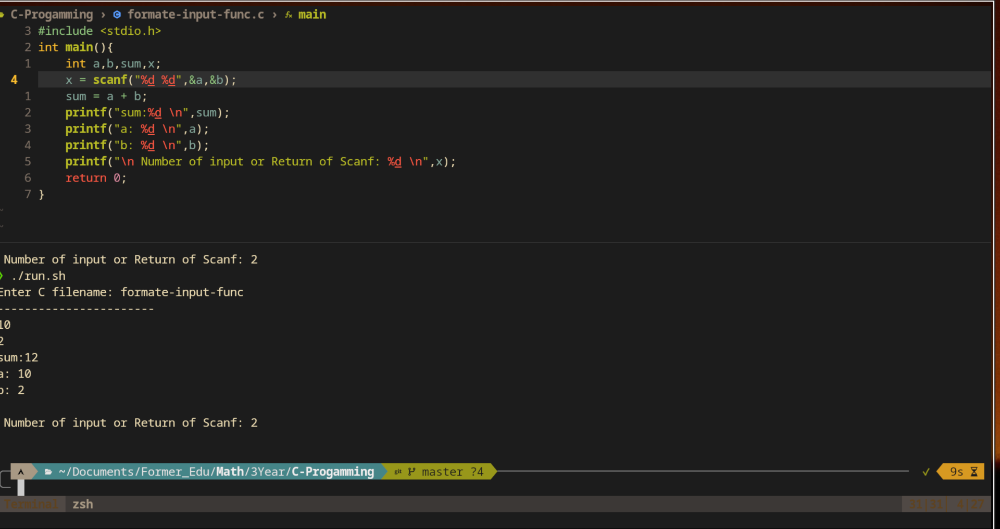
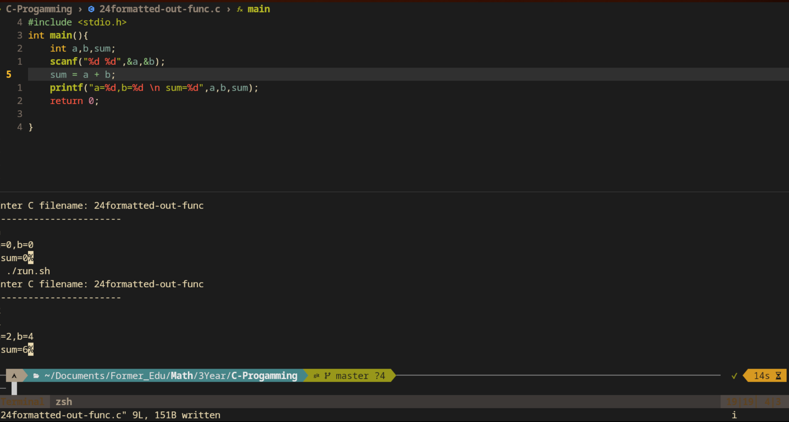

# C-Programming langague
## 23- Fromatted input function in C Langauge

> Syntax: \`\`\` scanf("control string", <arg1>, <arg2>, ..., <argn>j)</argn></arg2></arg1>

- arguments are address of the data in memeory
- it returns number of input
- it is defined inside stdio.h header file

### Example

```C
#include <stdio.h>
int main(){
    int a,b,sum;
    scanf("%d%d",&a,&b);
    sum = a + b;
    return 0;
}
```




## 24 Formatted output in Function 
*Synatx:*
```C
printf("control string",<arg1>,<arg2>,..)
```
- here only name of variable as argument _not_ the address of varaible
- here arugment are optional
- return the total no of char output in console

### Example


